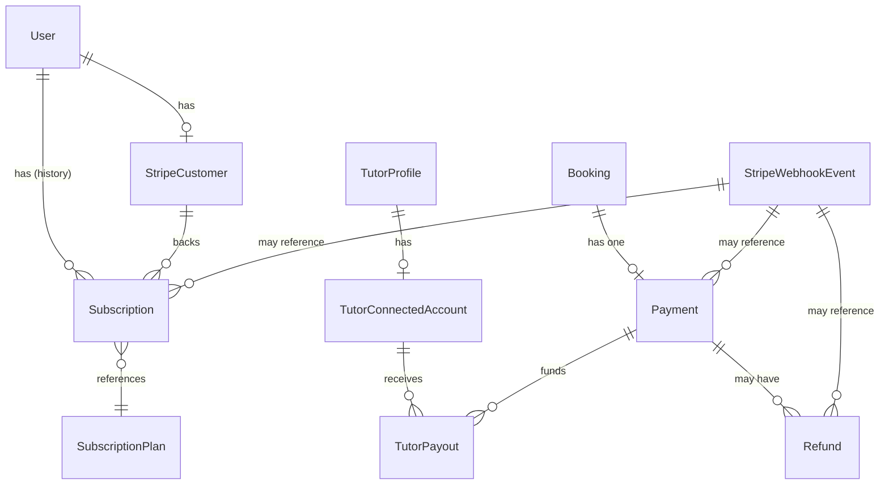
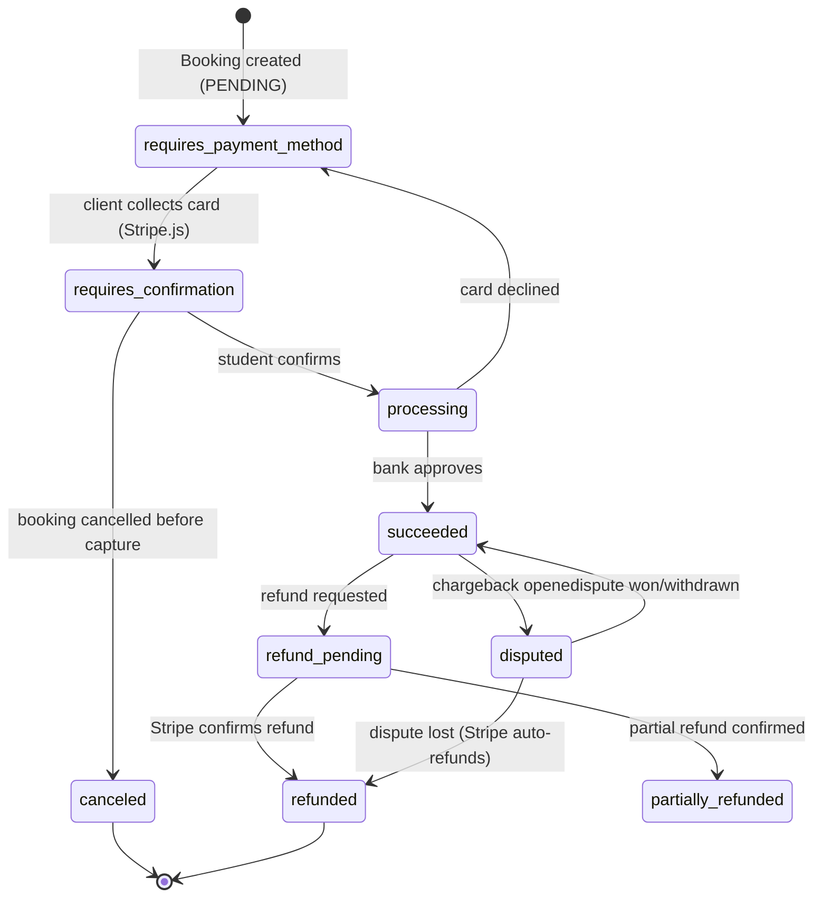
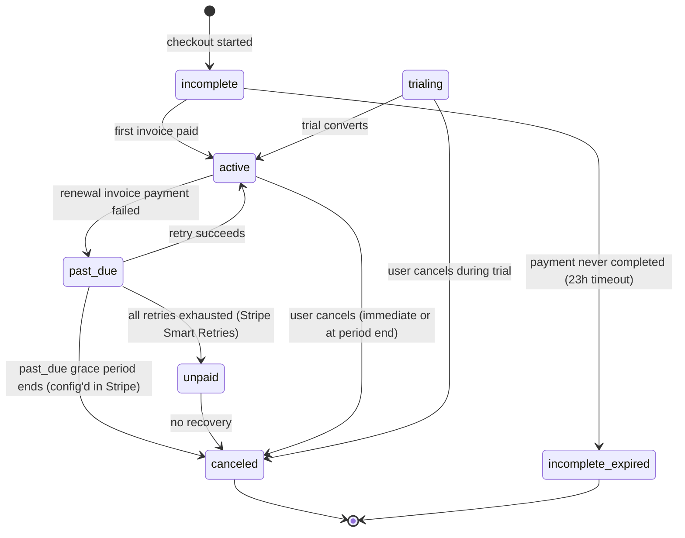
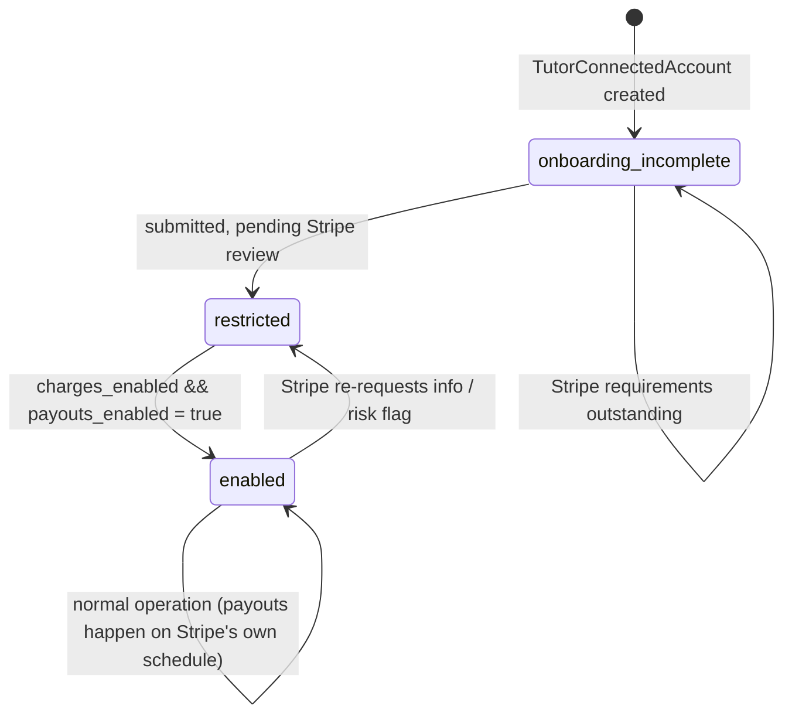
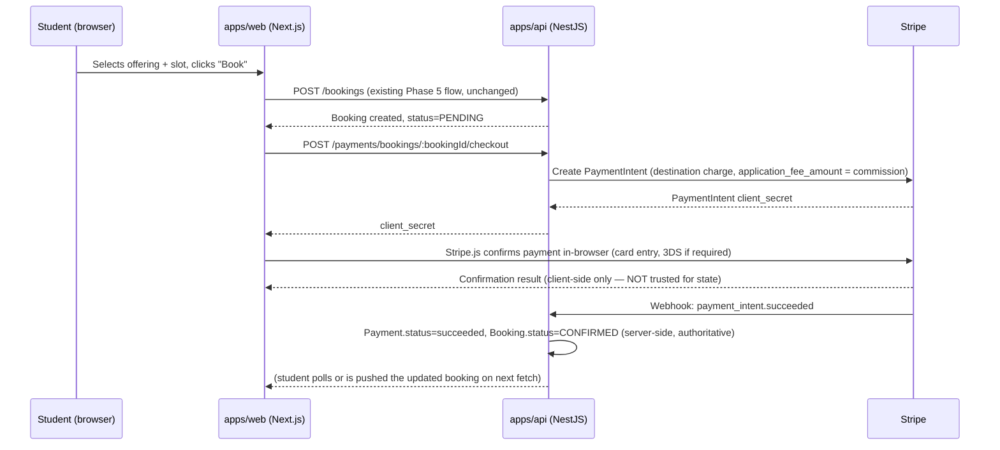
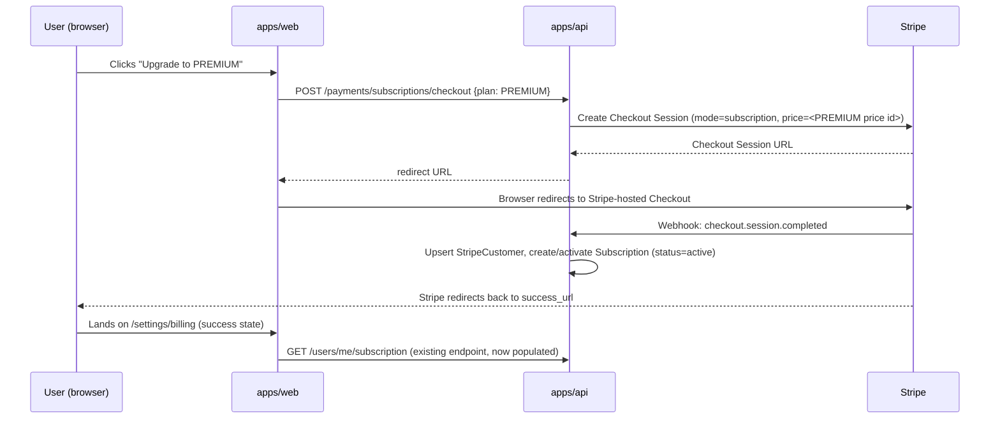
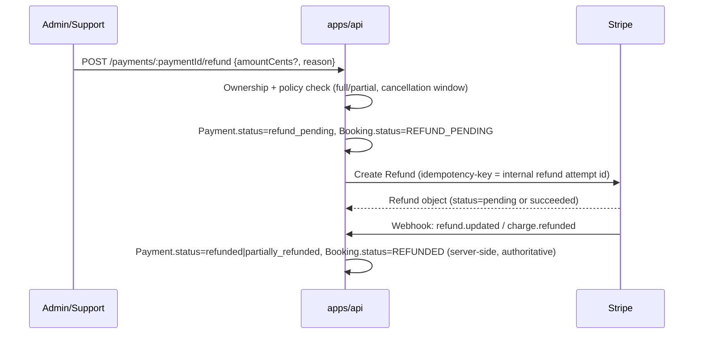

# Phase 6 Pre-Flight — Payment & Monetization Architecture Quality Gate

Status: **ANALYSIS ONLY — no code, no migration, no Stripe API calls, no secrets.**
This document is the deliverable for the Phase 6 pre-flight gate. Per instruction, work
stops after this report until explicit approval is given to begin implementation.

---

## 0. Verdict

**The existing Subscription/Booking foundation from Phases 2 and 5 is a good but
incomplete starting point. It is NOT sufficient for Phase 6 as it stands.** The good
news: every design decision made in Phases 2–5 was already made *with* Phase 6 in mind
(integer cents, `REFUND_PENDING`/`REFUNDED` booking statuses, "Payment fields
intentionally absent" comments, entitlements already derived server-side from a DB row
rather than a client claim). Phase 6 mostly needs to be **additive** — new tables, a new
module, new webhook surface — not a rework of what exists.

Two corrections to the brief, found by reading the actual code rather than assuming:

- **There is no `Transaction` model.** `packages/database/prisma/schema.prisma` has
  exactly one payment-adjacent table today: `Subscription` (`plan`, `status`,
  `startedAt`, `expiresAt` — no Stripe fields of any kind). There is no
  `Transaction`, `Payment`, `Invoice`, or `Payout` table anywhere in the codebase. If
  "Transaction-Struktur aus Phase 2" refers to something specific, it does not exist in
  this repo; treat everything payment-shaped in this document as new for Phase 6.
- **There is no subscription write path.** `SubscriptionController` (`apps/api/src/
  modules/entitlements/subscription.controller.ts`) is `GET`-only — it reads the
  caller's own active subscription. Nothing anywhere creates, upgrades, downgrades, or
  cancels a subscription today (not even a fake/manual path). Phase 6 is not "add
  Stripe to an existing paid-plan flow" — it is "build the paid-plan flow, with Stripe as
  its only source of truth, from nothing."

---

## 1. What Phase 6 inherits (current-state analysis)

| Concern | Current state | Verdict for Phase 6 |
|---|---|---|
| **Entitlements** | `EntitlementsService.canAccess(userId, entitlement)` derives entitlements from `Subscription.plan` read fresh from Postgres on every call — never cached client-side, never a role check. See `packages/types/src/entitlement.ts`. | **Keep unchanged.** This is exactly the trust boundary the brief demands ("Entitlements müssen aus vertrauenswürdigen serverseitigen Zahlungs-/Subscription-Daten abgeleitet werden"). Phase 6 only needs to make sure the *only* writer of `Subscription.plan`/`status` is the Stripe webhook handler. |
| **`SubscriptionStatus` enum** | `ACTIVE \| CANCELLED \| EXPIRED` — three values, no notion of `PAST_DUE`, `TRIALING`, `INCOMPLETE`, `UNPAID`. | **Insufficient.** Stripe's real subscription lifecycle has ~7 states (§15). Collapsing them into 3 loses exactly the states billing/dunning logic needs (`PAST_DUE` vs `CANCELLED` is the difference between "give a grace period" and "revoke access now"). Needs extending. |
| **Money on `Offering`** | `priceCents: Int`, `currency: String @default("EUR")` — integer minor units, never float. Comment: *"no payment processing yet (Phase 6), but the shape must already be Stripe-Connect-ready."* | **Correct, keep.** This is the right unit convention; reuse it everywhere new (never store `Decimal`/`Float` for money). |
| **`Booking.status`** | Already includes `REFUND_PENDING`, `REFUND ED` states, written in Phase 5 in anticipation of Phase 6. | **Good head start**, but a booking status alone cannot represent partial refunds, multiple refund attempts, or the Stripe PaymentIntent lifecycle underneath it. Needs a linked `Payment`/`Refund` model — see §2. |
| **Auth model** | `AuthGuard` verifies a short-lived (~60s) HMAC service token (`verifyServiceToken`, `apps/api/src/modules/auth/service-token.ts`) minted by Next.js; NestJS trusts *only* that token, never anything client-supplied directly. | **Directly reusable pattern** for Stripe webhook verification: same philosophy ("never trust the request; verify a signature server-side against a secret"), different mechanism (Stripe's HMAC-SHA256 over the raw body + timestamp, via `stripe.webhooks.constructEvent()`). |
| **IDOR convention** | Every ownership-scoped lookup across Phases 2–5 throws `NotFoundException` (404), never `ForbiddenException`, on a mismatch. | **Must carry over identically** to payment/subscription/payout endpoints — a student probing another student's payment history must get 404, not 403 (which confirms existence). |
| **Structured audit logging** | `AiObservabilityLogger` (`apps/api/src/modules/ai/logging/`) — JSON logs, grep-able `event` field, deliberately excludes sensitive content, only metadata. | **Good pattern, insufficient alone for money.** Logs are fine for *debugging*; they are not durable, queryable, or referentially linked to a booking/subscription row. Financial auditability needs a DB ledger table (§17), with structured logging as a *supplement*, not the record of truth. |
| **Interface-first provider abstraction** | Established twice already: `AiProvider`/`AiProviderFactory` (swap AI vendor) and `DocumentStorageProvider`/`LocalDocumentStorageProvider` (swap storage backend). | **Do NOT repeat this pattern for Stripe.** There is no realistic second EU-payments-and-Connect provider on the near-term roadmap, and an abstraction with one implementation is exactly the "unnecessary architecture" the spec repeatedly warns against. Isolate Stripe behind a thin service (testable, mockable) but do not build a `PaymentProvider` interface with only `StripeProvider` behind it. |
| **Ownership split: Next.js vs NestJS** | Next.js (`apps/web`) owns `User`/`Session`/`Account` tables directly via Prisma; it **never** touches `Subscription` today (confirmed: zero references). NestJS (`apps/api`) owns everything else, including the only `Subscription` read endpoint. | **Payments belong entirely in NestJS.** The Stripe webhook receiver, all `Payment`/`Refund`/`Subscription` writes, and Stripe API calls live in `apps/api`. `apps/web` only ever calls NestJS's REST API (server-to-server, via the existing service-token pattern) to render payment/subscription UI — it never talks to Stripe directly except for Stripe.js/Elements token collection in the browser, which never touches our servers with raw card data. |
| **Roles available** | `Role` enum already has `STUDENT, TUTOR, CONTENT_EDITOR, SUPPORT, ADMIN`. `SUPPORT` exists in the schema but is **not used anywhere yet** — every `@Roles()` decorator across Phase 5 uses `ADMIN` only. | Phase 6 is the first phase that needs to actually decide what `SUPPORT` can and cannot do (§ Permissions). This needs a product decision, not just an engineering one — flagged as open question. |

---

## 2. Payment Domain Model

New entities (names indicative, not final — this is analysis, not a migration).
Diagram shows ownership/cardinality, not the full column list (see §10 for columns).

| Entity | Purpose | Cardinality |
|---|---|---|
| `StripeCustomer` | 1:1 mirror of a Stripe `Customer` object per `User` — every user who ever enters a card flow (subscription OR booking) gets exactly one. | 1 per `User` |
| `Subscription` (extended) | Existing table, extended with Stripe linkage fields (§10). Still the single source of truth `EntitlementsService` reads. | Historical rows kept; **exactly one row may be "current"** per user at a time — see §15 for how "current" is determined without a boolean flag race. |
| `TutorConnectedAccount` | 1:1 mirror of a Stripe Connect **Express** account per tutor. Holds onboarding/capability state, never funds. | 1 per `TutorProfile`, created lazily on first "start earning" action, not at signup. |
| `Payment` | One row per **marketplace booking payment** (the one-time charge for a session). 1:1 with `Booking`. This is the row `Booking.status` transitions hang off of. | Exactly one non-superseded `Payment` per `Booking`. |
| `Refund` | One row per refund **attempt** against a `Payment` (partial or full; a `Payment` may have more than one, e.g. a partial refund followed later by the remainder). | 0..N per `Payment`. |
| `TutorPayout` | Local ledger mirror of Stripe Connect transfers/payouts to a tutor. **Reconciliation record, not an orchestration engine** — Stripe (via Connect's automatic payout schedule) actually moves the money; this table exists so support/admin/tutor can see payout history without calling Stripe's API live on every page load. | 0..N per `TutorConnectedAccount`; typically 1 per settled `Payment` after the platform fee is deducted, but Stripe may batch. |
| `StripeWebhookEvent` | Append-only ledger, one row per **received** Stripe event id. The idempotency backbone for the entire system (§4, §18). | 1 per Stripe event id (globally unique — enforced by a DB unique constraint on `stripeEventId`, not just application logic). |

**Explicitly out of scope for the domain model:** no `Invoice` line-item/PDF-generation
engine. Stripe Billing already generates and hosts invoices for subscriptions; Stripe
Tax (if enabled) computes VAT. The DB only needs enough linkage metadata to answer "what
did this user pay, when, for what, with what tax treatment" for support/audit purposes
— not to reconstruct a PDF. Building an invoicing engine now would be exactly the
"unnecessary architecture" the project has consistently avoided elsewhere.

---

## 3. State Machines

### 3.1 Payment (marketplace one-time booking payment) state machine

Mirrors a Stripe `PaymentIntent`'s real lifecycle — this is deliberately **not**
`Booking.status` (which stays the small, UX-facing enum it already is); `Payment.status`
is the finer-grained, Stripe-truthful state that `Booking.status` is *derived from*, never
the reverse.

`Booking.status` (existing enum, unchanged) maps *from* this, one-directionally:

| `Payment.status` | `Booking.status` |
|---|---|
| `requires_payment_method` / `requires_confirmation` / `processing` | `PENDING` |
| `succeeded` | `CONFIRMED` → `COMPLETED` (time-driven, unrelated to payment) |
| `canceled` | `CANCELLED` |
| `refund_pending` | `REFUND_PENDING` (existing value — was added in Phase 5 exactly for this) |
| `refunded` / `partially_refunded` | `REFUNDED` (existing value) |
| `disputed` | `CONFIRMED`/`COMPLETED` unchanged + a separate `Payment.disputedAt` flag surfaced to admin — a dispute must never silently look like a normal booking. |

### 3.2 Subscription state machine

Directly mirrors Stripe Billing's own subscription statuses — do **not** invent a
simplified version; every collapse loses information dunning logic needs.

**Entitlement rule** (the load-bearing sentence in this whole document):
`EntitlementsService.getActivePlan()` must treat **only** `status = active` (and,
if trials are offered, `trialing`) as entitled to the plan's features. `past_due` and
`unpaid` fall back to `FREE` entitlements immediately — access is revoked on the first
missed payment signal from Stripe, not after a grace-period UI decision made client-side.
Whether to grant a soft grace period (e.g. "still PREMIUM for 3 days into past_due") is a
**product decision**, not an engineering default — flag as open question (§16).

### 3.3 Tutor payout state machine

Deliberately thin — Stripe Connect (Express, with the platform on the **automatic**
payout schedule) does the actual money movement and scheduling. The local state machine
exists only to answer "can this tutor accept bookings yet" and "did this payout settle."

A tutor's offerings must **not** be bookable while `TutorConnectedAccount.status !=
enabled` — this is a new gate that does not exist in Phase 5 (Phase 5 has no payment
concept at all, so any `isActive` tutor is bookable today). This is a real behavior
change Phase 6 introduces, called out explicitly in §16 (rollout).

---

## 4. Stripe Object Mapping

| Stripe object | Local table | Notes |
|---|---|---|
| `Customer` | `StripeCustomer.stripeCustomerId` | Created on first checkout (subscription or booking), not at registration — avoids creating Stripe objects for users who never pay. |
| `PaymentMethod` | *(not stored locally beyond Stripe's own reference on the Customer)* | Card data never touches our servers (Stripe.js/Elements tokenizes in-browser). We optionally store `PaymentMethod.id` + brand/last4 for UI display only — never raw PAN, never CVC. |
| `Product` / `Price` | *(config, not DB rows)* — `PREMIUM`/`PRO` map to fixed Stripe Price IDs held in server-only env config, not the database. | Plan→Price mapping is deploy-time config, matching how `AI_PROVIDER` etc. are configured today. |
| `Subscription` | `Subscription.stripeSubscriptionId`, `.stripePriceId`, `.currentPeriodEnd`, `.cancelAtPeriodEnd` | Webhook-driven only (§5). |
| `Checkout Session` (subscriptions) | *(ephemeral, not stored — its `session.completed` webhook is what matters)* | Recommended over raw `PaymentIntent` API for subscription checkout — Stripe-hosted, PCI scope minimized, EU 3D-Secure/SCA handled by Stripe's own UI. |
| `PaymentIntent` (bookings) | `Payment.stripePaymentIntentId`, `.status`, `.amountCents`, `.currency` | One-time marketplace charge per booking. |
| `Charge` | `Payment.stripeChargeId` (denormalized off the PaymentIntent for dispute lookups) | Disputes attach to the Charge, not the PaymentIntent, in Stripe's model. |
| `Refund` | `Refund.stripeRefundId`, `.amountCents`, `.status`, `.reason` | |
| `Account` (Connect, Express) | `TutorConnectedAccount.stripeAccountId`, `.chargesEnabled`, `.payoutsEnabled`, `.detailsSubmitted` | |
| `Transfer` (platform → connected account) | `TutorPayout.stripeTransferId` | Represents the platform-fee-deducted amount moving to the tutor's Stripe balance. |
| `Payout` (connected account → tutor's bank) | `TutorPayout.stripePayoutId` (nullable until Stripe reports it) | Only observable via webhook from the *connected account's* events — requires `Stripe-Account` header context, see §5. |
| `Dispute` | `Payment.disputedAt`, `.disputeStatus` (denormalized fields, no separate table needed at this scale) | |
| `Event` (every webhook) | `StripeWebhookEvent.stripeEventId` (unique), `.type`, `.payload` (raw JSON), `.processedAt`, `.processingError` | The idempotency + audit backbone. |

**Platform commission model:** Stripe Connect's `application_fee_amount` on the
PaymentIntent (destination charges) is the correct mechanism — the platform charges the
student directly, Stripe automatically splits `application_fee_amount` to the platform
and the remainder to the connected account in one atomic operation. This avoids a
separate "platform collects, then manually pays out tutor" flow, which would put us in
the business of holding tutors' money (a materially different regulatory position —
likely requiring an e-money license in the EU — that destination charges avoid entirely
by design). **This is a load-bearing recommendation, not a detail**: do not build a
"platform-collects-then-transfers" flow.

---

## 5. Webhook Architecture

### Endpoint

`POST /api/v1/payments/webhooks/stripe` (NestJS, `apps/api`) — the only endpoint in the
entire payment surface that is `@Public()` (no service-token auth, since Stripe cannot
mint one). Security instead comes entirely from signature verification (below). A
**second**, separate endpoint is needed for Connect account events
(`POST /api/v1/payments/webhooks/stripe-connect`), since Stripe delivers platform events
and connected-account events as logically distinct webhook subscriptions even though
both hit "our server."

### Processing pipeline (every event, no exceptions)

1. **Raw body capture.** The route must receive the **raw, unparsed** request body —
   Stripe's signature is computed over the exact bytes sent. NestJS's default global
   `express.json()` body parser must be bypassed for this one route (a documented Nest
   pattern: `bodyParser: false` + a route-specific raw middleware), otherwise signature
   verification fails 100% of the time in production, only "working" in naive manual
   testing where nobody checks the signature at all.
2. **Signature verification** via `stripe.webhooks.constructEvent(rawBody, signatureHeader,
   endpointSecret)`. Reject (400) on any failure — expired timestamp, bad signature,
   wrong secret. This is the same trust posture as `verifyServiceToken()`: **the payload
   is not trusted until the signature says it's genuinely from Stripe.**
3. **Idempotency check** — `INSERT INTO stripe_webhook_events (stripe_event_id, type,
   payload, ...) ON CONFLICT (stripe_event_id) DO NOTHING`, then check the row count. If
   the insert did nothing, the event was already seen (Stripe redelivers on any non-2xx
   response, and even on 2xx occasionally per their own docs) — return `200 OK`
   immediately without reprocessing. **This is the entire idempotency guarantee** — it
   must exist before any business logic runs, in the same transaction/request, not as an
   afterthought.
4. **Dispatch by `event.type`** to a handler that updates exactly the tables relevant to
   that event (`checkout.session.completed` → activate `Subscription`;
   `invoice.payment_failed` → `past_due`; `payment_intent.succeeded` → `Payment.succeeded`
   + `Booking.CONFIRMED`; `charge.dispute.created` → `Payment.disputedAt`; etc.).
5. **Mark processed** — update the `StripeWebhookEvent` row with `processedAt` and, on
   failure, `processingError` (still return 200 to Stripe for events where the failure is
   "we don't handle this type," but return 500 for genuine processing errors so Stripe's
   automatic retry gives us another chance — these are different failure modes and must
   not be conflated).
6. **Always respond within Stripe's timeout window** (a few seconds) — any slow
   downstream work (sending a confirmation email, recomputing a derived stat) happens
   *after* the 200 is sent or is offloaded, never blocks the webhook response.

### Why this cannot be simplified

The brief's non-negotiables map directly onto this pipeline: "Webhook-Verarbeitung muss
idempotent sein" is step 3; "Stripe-Webhooks müssen serverseitig verifiziert werden" is
step 2; "Keine Zahlung darf doppelt verarbeitet werden" is steps 2+3 together (a forged
request fails at 2, a genuine duplicate is absorbed at 3).

---

## 6. Marketplace Money Flow (one-time booking payment)

**The critical line is "NOT trusted for state."** The browser-side confirmation result
tells the UI "show a spinner/success state to the user right now" — it must never be
what flips `Booking.status` to `CONFIRMED`. Only the webhook does that. A student closing
the tab immediately after paying, before the webhook lands, must still end up with a
correctly confirmed booking a few seconds later — the UI polls or re-fetches, it does not
assume.

## 7. Subscription Money Flow

Using Stripe **Checkout** (hosted) rather than building a custom card form is a
deliberate recommendation: it keeps PCI scope at SAQ-A (no card data ever transits our
code, even tokenized), and Stripe's hosted page already handles SCA/3D-Secure for EU
cards without any bespoke logic on our side — directly serving the "EU-tauglich"
requirement in the brief.

## 8. Refund Flow

Refund **initiation** is always server-initiated by an authenticated ADMIN/SUPPORT
action (or a self-service student cancellation endpoint that itself triggers this same
internal path under a defined policy — see §16 for who can self-serve). **Refund
completion status is always webhook-driven**, identically to the booking-payment flow —
Stripe's synchronous API response to a refund request is not itself the source of truth
for whether money actually moved (a refund can be created successfully and still later
fail, e.g. `refund.failed`).

## 9. Failure Flow (declined card, expired session, webhook processing error)

| Failure | Where it's caught | Resulting state |
|---|---|---|
| Card declined at Stripe.js confirmation | Browser, surfaced instantly by Stripe.js | `Payment` never reaches `succeeded`; `Booking` stays `PENDING` and expires after a TTL (needs a scheduled job — see §16 open item) so the availability slot isn't held forever by a failed payment. |
| `payment_intent.payment_failed` webhook | Webhook handler | `Payment.status` recorded as failed; booking slot released. |
| Subscription renewal fails | `invoice.payment_failed` webhook | `Subscription.status = past_due`; Stripe Smart Retries run automatically; entitlements degrade per §3.2's rule. |
| Webhook handler throws (e.g. DB momentarily down) | Step 5 of §5's pipeline | Respond 5xx; Stripe retries with backoff for up to ~3 days per their default retry schedule — no data is lost as long as the idempotency row from step 3 either committed or rolled back atomically with the rest of the transaction. |
| Duplicate/replayed webhook | Step 3 of §5's pipeline | Absorbed silently, 200 returned, no reprocessing — this is not an "error" state, it's the expected steady-state behavior of any webhook-based system. |

---

## 10. Database Changes (described — no migration authored in this pass)

New tables (columns indicative):

- **`stripe_customers`**: `userId (PK, FK User, unique)`, `stripeCustomerId (unique)`,
  `createdAt`.
- **`subscriptions`** (extend existing table): add `stripeCustomerId`,
  `stripeSubscriptionId (nullable, unique)`, `stripePriceId`, `currentPeriodEnd`,
  `cancelAtPeriodEnd (boolean)`. Extend `SubscriptionStatus` enum to Stripe's real set
  (`incomplete`, `incomplete_expired`, `trialing`, `active`, `past_due`, `canceled`,
  `unpaid`) — this is an additive enum change (new values), not a removal, so it's
  backward compatible with existing rows.
- **`tutor_connected_accounts`**: `tutorId (PK, FK TutorProfile, unique)`,
  `stripeAccountId (unique)`, `chargesEnabled`, `payoutsEnabled`, `detailsSubmitted`,
  `createdAt`, `updatedAt`.
- **`payments`**: `id (PK)`, `bookingId (FK Booking, unique — enforces 1:1)`,
  `stripePaymentIntentId (unique)`, `stripeChargeId (nullable)`, `amountCents`,
  `applicationFeeCents`, `currency`, `status`, `disputedAt (nullable)`,
  `disputeStatus (nullable)`, `createdAt`, `updatedAt`.
- **`refunds`**: `id (PK)`, `paymentId (FK Payment)`, `stripeRefundId (unique)`,
  `amountCents`, `status`, `reason`, `initiatedByUserId (FK User)`, `createdAt`.
- **`tutor_payouts`**: `id (PK)`, `tutorId (FK TutorConnectedAccount)`,
  `paymentId (FK Payment, nullable — a payout may batch several payments)`,
  `stripeTransferId (nullable, unique)`, `stripePayoutId (nullable, unique)`,
  `amountCents`, `status`, `createdAt`.
- **`stripe_webhook_events`**: `id (PK)`, `stripeEventId (unique, NOT NULL)`, `type`,
  `payload (jsonb)`, `receivedAt`, `processedAt (nullable)`,
  `processingError (nullable)`.

Indexing notes: `stripeEventId` unique index is the single most important index in the
whole schema addition — it is the entire idempotency guarantee, not a performance nicety.
`payments.bookingId` unique enforces "one payment per booking" at the DB level (mirrors
how `bookings_no_overlapping_active_ranges` enforces double-booking prevention at the DB
level in Phase 5 — same philosophy: **the database is the last line of defense, not just
the application code**).

**No migration is written in this pass**, per instruction.

---

## 11. API Boundaries

All new endpoints live in `apps/api` under a new `PaymentsModule`
(`apps/api/src/modules/payments/`), following the existing modular structure. Indicative
surface (methods/paths, not final):

| Endpoint | Auth | Notes |
|---|---|---|
| `POST /payments/subscriptions/checkout` | `@CurrentUser()`, any authenticated role | Body: `{plan}`. Returns a Checkout Session URL. |
| `GET /users/me/subscription` | existing, unchanged | Already correctly scoped. |
| `POST /payments/subscriptions/cancel` | `@CurrentUser()` | Self-service cancel-at-period-end (never immediate hard revoke without policy sign-off — see §16). |
| `POST /payments/bookings/:bookingId/checkout` | `@CurrentUser()`, must be the booking's student (404 on mismatch) | Creates the PaymentIntent for an existing PENDING booking. |
| `POST /payments/:paymentId/refund` | `@Roles(ADMIN, SUPPORT)` — scope TBD, see open questions | |
| `GET /users/me/payments` | `@CurrentUser()` | Student's own payment history. |
| `POST /payments/connect/onboarding-link` | `@Roles(TUTOR)`, self only | Creates/refreshes a Stripe Connect onboarding link for the calling tutor. |
| `GET /tutors/me/payouts` | `@Roles(TUTOR)`, self only | Tutor's own payout history. |
| `GET /payments/admin/...` | `@Roles(ADMIN)` (+ possibly `SUPPORT`, read-only subset) | Admin dashboards: all payments, disputes, refund queue. |
| `POST /payments/webhooks/stripe` | `@Public()`, signature-verified instead | See §5. |
| `POST /payments/webhooks/stripe-connect` | `@Public()`, signature-verified instead | See §5. |

Every non-webhook, non-admin endpoint follows the existing `@CurrentUser()`-scoping
convention (no client-supplied user/tutor id where avoidable) and the existing IDOR
convention (404 on ownership mismatch, never 403).

## 12. Frontend Boundaries

`apps/web` never calls Stripe's API server-side and never sees a Stripe secret key.
Its only Stripe-facing surface is:

- **Stripe.js / Elements** (client-side only) for the booking-payment card form, loaded
  with the **publishable** key only (`NEXT_PUBLIC_STRIPE_PUBLISHABLE_KEY`, safe to expose
  — this is the one genuinely public Stripe key by design).
- **Redirect to Stripe-hosted Checkout** for subscriptions (no card form built at all for
  this flow — see §7).
- All other payment data (subscription status, payment history, payout history) is
  fetched from `apps/api` exactly like every other domain today (`callNestApi`, the
  existing server-to-server pattern used throughout Phase 5's `lib/api/*.ts` files) —
  never read from `localStorage`, a cookie, or any client-writable source. This is the
  concrete mechanism satisfying "Geldstatus darf niemals ausschließlich aus Client-Daten
  kommen."

## 13. Security Model

| Threat | Mitigation |
|---|---|
| Forged webhook (attacker POSTs a fake `checkout.session.completed` to grant themselves PREMIUM for free) | Signature verification (§5 step 2) — the endpoint is `@Public()` but every payload is cryptographically checked before any table is touched. |
| Replayed genuine webhook (double-processing) | Idempotency ledger (§5 step 3). |
| Client claims a plan it doesn't have (`{"plan": "PRO"}` in a request body) | Never accepted — no endpoint anywhere sets `Subscription.plan` from a request body; only the webhook handler writes it, driven by the Stripe Price ID on the actual paid subscription. |
| Card data theft / PCI scope | Never touches our servers — Stripe.js tokenizes in-browser (booking flow) or Stripe hosts the entire form (subscription flow via Checkout). SAQ-A eligible. |
| Tutor triggers their own payout | Not possible by construction — payouts are Stripe Connect's automatic schedule (§3.3); no endpoint exists to manually trigger a transfer/payout from client input. Directly satisfies "Keine Tutor-Auszahlung darf clientseitig ausgelöst werden." |
| IDOR on payment/refund/payout endpoints | Same 404-not-403 convention as every other Phase 2–5 resource (§1). |
| Secrets in the repo | `STRIPE_SECRET_KEY`, `STRIPE_WEBHOOK_SECRET`, `STRIPE_CONNECT_WEBHOOK_SECRET` are server-only env vars in `apps/api/.env` (never `.env.example` gets a real value, matching the existing `ANTHROPIC_API_KEY=""` convention) — never committed, never logged. `NEXT_PUBLIC_STRIPE_PUBLISHABLE_KEY` is the only Stripe credential that is intentionally public. |
| Rate limiting / abuse of checkout creation | Reuse the existing rate-limiter pattern from `apps/web/lib/security/rate-limiter.ts` (established in Phase 1) on checkout-session-creation endpoints — prevents a script from hammering Stripe API creation calls. |
| Fraud (stolen card testing via the platform) | Delegate to **Stripe Radar** (included free at standard tiers) rather than building bespoke fraud heuristics — appropriate given team size/stage; revisit only if Radar proves insufficient. |
| Disputes/chargebacks | `charge.dispute.created` webhook flips `Payment.disputedAt` and (recommended) auto-suspends that tutor's ability to receive new bookings pending admin review — a product policy decision, flagged open (§16). |

---

## 14–15. (Subscription/Payment) State Machines

Covered together in §3 above (both diagrams live there to keep the payment vs.
subscription lifecycle comparison legible side by side).

## 16. Test Strategy

Following the pure-function-first precedent already established
(`availability-slots.ts` in Phase 5.3 — DST-correctness tested without mocking Prisma):

- **Pure state-transition functions** (`isValidSubscriptionTransition(from, to)`,
  `computePlatformFee(amountCents, rate)`, `computeRefundEligibility(booking, now)`) —
  unit-tested with zero Stripe SDK or DB involvement, the same way booking-slot math is
  tested today.
- **Webhook handler tests** — Nest unit tests with a **mocked** `stripe.webhooks
  .constructEvent` (inject a fixed, valid-looking parsed event) and a real
  (test-database-backed or fully-mocked Prisma) idempotency check, asserting: (a) a
  known event id processed twice only mutates state once, (b) an unknown/malformed
  signature is rejected before any table write, (c) each event `type` updates exactly the
  expected fields.
- **e2e authorization tests** — identical pattern to every `*-authorization.e2e-spec.ts`
  file already in the repo: no token → 401, wrong role → 403, malformed body →
  400 (ValidationPipe), all without touching a real database (matches the existing
  no-DB-in-CI strategy documented in the Phase 5 ADR).
- **Manual, non-CI Stripe test-mode verification script** — mirrors
  `scripts/verify-booking-concurrency.ts`'s precedent exactly: a script that exercises
  real Stripe **test-mode** API calls (test card numbers, Stripe CLI's `stripe trigger`
  for webhook simulation) is documented and runnable on demand, but never wired into CI,
  because CI has no real Stripe credentials and shouldn't need any to stay green. This
  script is how a human verifies the actual Stripe integration end-to-end before each
  release touching payments.
- **No fake success paths.** Consistent with the project's existing "keine
  Fake-AI-Ergebnisse" discipline for AI: without real Stripe test-mode credentials
  configured, payment endpoints must fail cleanly and honestly (e.g., a clear
  "payments not configured" error), never fabricate a `succeeded` payment.

## 16b. Rollout Strategy

1. **Stripe test mode, internal only.** Full flow working end-to-end against Stripe's
   test mode, verified via the manual script above, no real users involved.
2. **Feature-flagged subscriptions first** (simpler flow — no Connect, no split payments)
   for a small cohort, monitoring webhook success rate and entitlement-correctness
   before opening to all users.
3. **Feature-flagged Connect onboarding for a small tutor cohort** — Stripe Express
   accounts, small number of hand-picked tutors, verify real payouts land correctly
   before every tutor can onboard.
4. **General availability**, subscriptions and bookings-with-payment both live, with the
   existing free-tier/booking-without-payment behavior fully retired only once payment
   flows are proven stable (not a hard cutover on day one).

Feature-flagging mechanism: reuse whatever gate the project already has (referenced
elsewhere in this session as "GrowthBook gate" tooling) rather than inventing a new
flag system for this phase alone.

## 16c. Sandbox / Test Mode Strategy

- Every non-production environment (local dev, CI, staging) uses **Stripe test mode**
  keys exclusively — enforced by convention (test keys are literally prefixed
  `sk_test_`/`pk_test_`) and, ideally, a startup assertion that refuses to boot with a
  live key (`sk_live_`) outside a designated `production` environment.
- Stripe CLI (`stripe listen --forward-to localhost:4000/api/v1/payments/webhooks/
  stripe`) is the local-dev webhook delivery mechanism — documented in a
  developer-setup doc, not built into the app itself.
- Test card numbers (Stripe's published `4242 4242 4242 4242` etc., including the
  specific EU/SCA-triggering test cards) are the only cards ever used pre-production.

## 16d. Production Readiness Checklist

Not "done" items — a checklist to run *before* enabling live payments, once
implementation is complete and approved:

- [ ] Live-mode Stripe account fully activated (business verification complete)
- [ ] Live webhook endpoint registered in Stripe dashboard, signing secret in prod env only
- [ ] `STRIPE_SECRET_KEY`/`STRIPE_WEBHOOK_SECRET` present only in the production secret
      store, never in any `.env` file committed anywhere, ever
- [ ] Refund/dispute/support runbook written and reviewed by whoever holds the SUPPORT
      role in practice
- [ ] Platform commission rate confirmed with legal/finance (this document does not set
      a number)
- [ ] VAT/tax treatment confirmed — whether Stripe Tax is enabled, and for which
      jurisdictions, is a finance/legal decision (§ Open Questions)
- [ ] Data retention period for `stripe_webhook_events.payload` (raw JSON) defined and
      enforced (GDPR minimization — see below)
- [ ] Connect platform Terms of Service accepted, tutor payout schedule confirmed
      (daily/weekly/monthly)
- [ ] Monitoring/alerting on webhook failure rate and `processingError` rows
- [ ] Load-tested checkout-session creation against the rate limiter's configured limits

---

## 17. Reconciliation & Auditability

`stripe_webhook_events` is the audit trail: every state change to `payments`,
`subscriptions`, `refunds`, and `tutor_payouts` is traceable to exactly one webhook event
row (via a `sourceEventId` FK on each of those tables, not shown in §10's column list for
brevity but required). This answers "why did this row change" without needing to query
Stripe's API retroactively. A periodic (not real-time) reconciliation job — comparing
local `payments`/`tutor_payouts` totals against Stripe's own Balance Transaction report
for the same period — is the standard practice for catching any drift (a webhook that
was missed entirely despite retries, e.g. during an extended outage); this is an
operational job to build alongside the core flow, not before it, but must not be
forgotten.

## 18. Double Payment Prevention

Three independent layers, matching the "belt-and-suspenders" philosophy already used for
double-booking prevention in Phase 5 (app-level pre-check + DB-level `EXCLUDE`
constraint):

1. **Booking→Payment uniqueness** — `payments.bookingId` has a DB unique constraint; a
   second checkout attempt for an already-paid booking is rejected before any Stripe
   call is made.
2. **Stripe idempotency keys** — every outbound Stripe API call that creates a
   PaymentIntent/Refund/Transfer is sent with an `Idempotency-Key` header derived from a
   stable internal identifier (e.g. `booking:{bookingId}:checkout`) — a client retry
   (network blip, double-click) hitting our API twice still only creates one Stripe
   object.
3. **Webhook idempotency** (§5 step 3) — even if the above somehow both failed, a
   duplicated *event* still cannot double-apply its effect.

## 19–20. Currency / EUR

**EUR only for v1.** `Offering.currency` already defaults to `"EUR"` and nothing in
Phase 5 exercises any other value. Do not build multi-currency support speculatively —
Stripe's own amount handling (integer minor units) is already the convention in use
(`priceCents`); extending to other currencies later is additive (a `currency` column
already exists on `Offering`) and should be deferred until there's an actual EU market
requiring it (e.g. a non-Eurozone member state).

## 21. VAT / Tax Metadata Architecture

Recommend **Stripe Tax** (automatic VAT calculation/collection, EU OSS-aware) rather than
building tax logic in-house — this is squarely a "don't build what Stripe already solves
correctly" case, especially for EU VAT's genuine complexity (B2C vs B2B/reverse-charge,
per-country rates, digital-services-specific VAT rules that this platform's tutoring
sessions plausibly fall under). The DB's job is minimal: store `Payment.taxAmountCents`
and `Payment.taxBehavior`/`countryCode` as **metadata mirrored from Stripe**, never
computed locally. Whether to enable Stripe Tax now or defer (it has its own pricing) is
a finance decision — flagged open.

## 22. Invoice Metadata

Stripe Billing auto-generates and hosts subscription invoices (PDF + hosted page) —
`Subscription`-linked invoices need no local storage beyond the Stripe object id, if
even that (Stripe's customer portal can be the entire self-service invoice UX). For
one-time booking payments, a Stripe **receipt** (not a formal invoice) is Stripe's
default; whether tutors, as EU sole-trader-adjacent sellers, need actual VAT invoices
issued *to students* is a legal question specific to the marketplace structure chosen
(is DeutschFlow the merchant of record, or is each tutor?) — this is the single biggest
open legal question in the whole document (see Open Questions) and materially changes
the Stripe Connect charge type (destination charges assume platform-as-merchant-of-record
in most interpretations; direct charges would make each tutor the merchant of record with
very different invoicing obligations).

## 23. GDPR / Data Minimization

- No raw card data ever stored (§13).
- `StripeWebhookEvent.payload` contains Stripe's full event JSON, which can include
  customer email/name — this is genuinely personal data and needs a defined retention
  window (recommend: short, e.g. 90 days, with the *derived* rows in `payments`/
  `subscriptions` kept per normal financial-record retention requirements, since those
  don't need the raw payload once processed).
- On account deletion (existing `deleteAccount` flow from Phase 1), `Subscription`/
  `Payment`/`Refund` history must be **retained** (financial/tax record-keeping
  obligations typically override GDPR erasure for transaction records — this is a real
  legal exception, not an oversight) while `StripeCustomer` and any PII-bearing fields
  not legally required to persist are what actually gets removed/anonymized. This needs
  legal sign-off on exactly which fields survive deletion, not an engineering default.
- Stripe itself is a sub-processor — a DPA with Stripe (standard, already exists as part
  of their terms) and an entry in DeutschFlow's own privacy policy/processor list is a
  compliance task, not an engineering one, but is a hard blocker for the production
  readiness checklist (§16d).

## 24. Auditability

Covered in §17 — restated here only to confirm it's addressed, not duplicated.

## 25–28. Admin / Support / Student / Tutor Permissions

| Role | Can see | Can act |
|---|---|---|
| **STUDENT** | Own payment history, own subscription, own booking payment status | Initiate own checkout, initiate own subscription cancel (per policy), initiate own booking cancellation (which triggers a refund per policy — not a direct refund API call) |
| **TUTOR** | Own payout history, own Connect onboarding status, own earnings | Start/continue Connect onboarding for self only; **cannot** trigger a payout, **cannot** see other tutors' or platform-wide financials |
| **SUPPORT** | *(open question — see below)* Recommended: read-only across all payments/subscriptions/refund status for customer-support purposes | Recommended: can **initiate** a refund up to a capped amount/policy, cannot change platform commission, cannot access Stripe dashboard credentials |
| **ADMIN** | Everything | Full refund authority, dispute response coordination, Connect account review, commission-rate configuration (server-side config, not a runtime-editable-by-request value) |

**Open question, flagged rather than decided unilaterally:** the brief lists "Support
permissions" as its own numbered item, and `SUPPORT` exists in the `Role` enum but has
never been used in any `@Roles()` decorator through Phase 5. Whether SUPPORT gets refund
authority (and up to what amount/without secondary approval) is a real policy decision
this document should not make on its own — proposed above as a reasonable default,
not as a final answer.

## 29. Fraud / Risk Handling

Delegate to Stripe Radar (§13). The one platform-specific risk not covered by generic
card-fraud tooling: a tutor and a student colluding to book-and-immediately-cancel
sessions to extract payouts, or a tutor self-booking through a second account. Neither is
addressed by Stripe Radar (it's marketplace-specific abuse, not card fraud) — recommend
a simple velocity check (e.g., flag for admin review if the same two users have an
unusual pattern of book/cancel/refund cycles) as a Phase 6+ follow-up, not a blocker for
initial launch, but noted so it isn't forgotten.

## 30. Chargebacks / Disputes

Covered in §3.1 (state machine), §9 (failure flow), §13 (security model). The one
addition here: Stripe requires **evidence submission** for a disputed charge within a
short window (typically ~7-21 days depending on card network) — this needs either a
manual admin workflow (check the Stripe dashboard directly, acceptable at low volume) or,
later, a "dispute evidence" admin UI. Not required for initial launch given expected
early volume; flagged as a scaling concern, not a v1 blocker.

---

## Open Questions Requiring a Product/Legal Decision Before Implementation

These are the places this document deliberately stopped short of deciding unilaterally,
because they are business/legal decisions, not engineering ones:

1. **Merchant of record**: is DeutschFlow the merchant of record for tutoring sessions
   (Connect *destination* charges — recommended, simpler), or is each tutor (Connect
   *direct* charges — each tutor is their own VAT-liable seller)? This single decision
   changes §4's commission mechanism, §22's invoicing obligations, and §21's tax
   architecture. **Recommend destination charges** as the default assumption used
   throughout this document, but this needs explicit confirmation.
2. **Platform commission rate** — not set anywhere in this document by design.
3. **Cancellation/refund policy** — the actual time-windows and refund percentages
   (e.g. "full refund if cancelled >24h before session") are not defined here; §3.1 and
   §8 describe the *mechanism*, not the *policy numbers*.
4. **SUPPORT role's refund authority** — proposed default in §25–28, needs sign-off.
5. **Subscription past_due grace period** — hard-revoke on first missed payment, or a
   short grace window? (§3.2)
6. **Whether Stripe Tax is enabled**, and for which jurisdictions (§21) — has its own
   Stripe pricing implication.
7. **PENDING-booking payment-abandonment TTL** — how long an unpaid PENDING booking
   holds a slot before auto-release (§9) — not a technical constant to pick alone,
   affects marketplace UX/tutor experience.

---

## Confirmation of Constraints Honored in This Pass

- No code written.
- No Prisma migration authored or run.
- No Stripe API called (test or live).
- No secrets referenced beyond documenting *which* env var names will eventually be
  needed (matching the existing `.env.example` documentation convention — no values).
- Stopping here, per instruction, pending approval to begin Phase 6 implementation.
